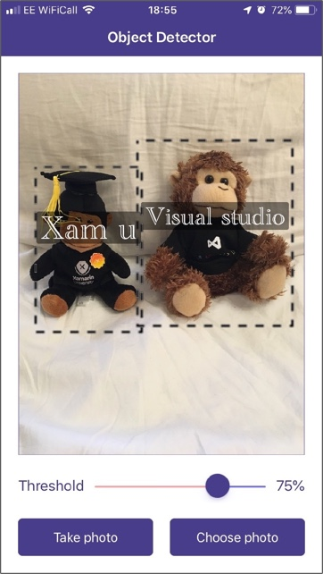
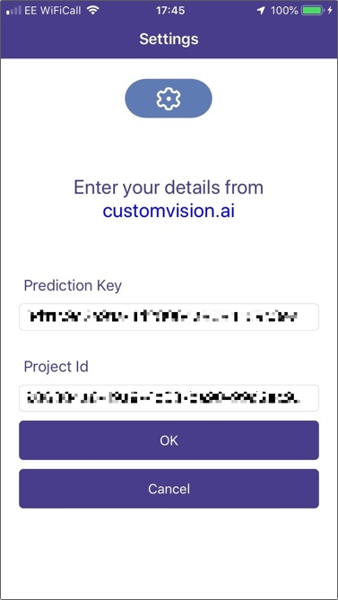

# Object Detector

A simple custom vision object detector sample app.

The [Azure Custom Vision Service](https://customvision.ai) has recently been updated to support object detection - you can train the model by identifying objects in an image and tagging those objects. Once trained, the model can not only identify multiple objects in the same image, but it can provide the bounding box - that is the location in the image of the object.

This sample app uses the [Prediction SDK](https://www.nuget.org/packages/Microsoft.Azure.CognitiveServices.Vision.CustomVision.Prediction/0.10.0-preview) to process your images looking for objects. You can point it at any object detection project and it will identify any objects detected with a probability of greater than 75%. Once detected it will show the image on screen with bounding boxes drawn around each object and labels added.

## To use this sample

* Create an Object Detection model at https://customvision.ai.
* Train the model for the objects you are interested in.
* Set one iteration of the model as default.
* Launch the app. Enter your prediction key and project id in the settings screen.
* Run the app, take a photo of the objects you've trained it on and see the results.
    
* If you want to change the project or prediction key, tap the settings button
    

You can read more on this service at https://aka.ms/XamObjectDetection.
